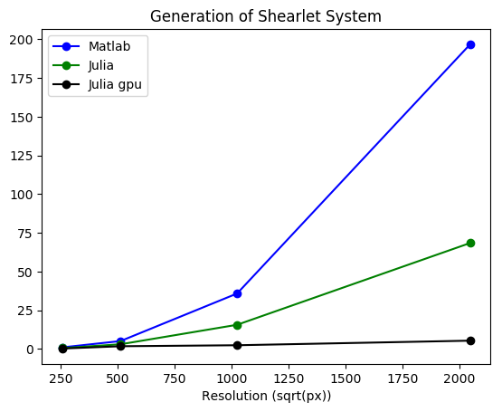
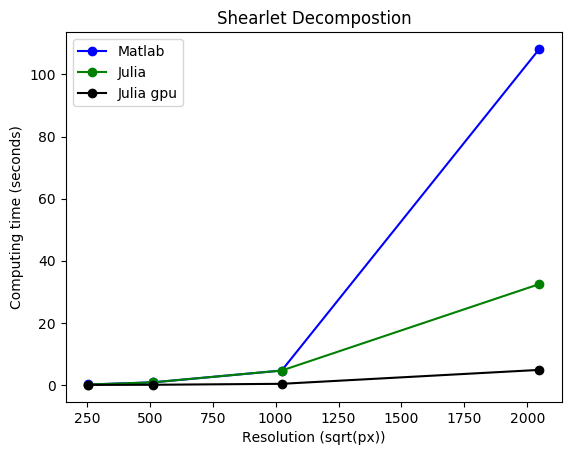
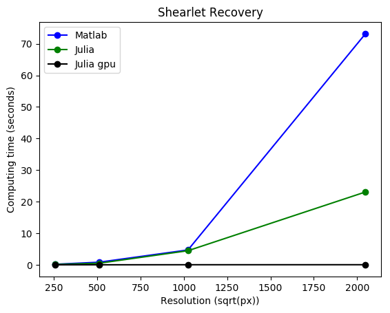

### 
 Benchmarks on Shearlet System Generation Decoding and Reconstruction. 

- **2D version.**

| Benchmark     |    Matlab(seconds)     |    Julia no gpu(seconds)     |  Julia gpu (seconds)  | Improvement rate no gpu | Improvement rate gpu |
|:-------------:|:-------------:|:------------:|:----------------:|:------------------------:|:-----------------------:|
| Shearlet System 256x256| 1.06 | 0.61 | 0.31 | 1.73 |3.42 |
| Decoding 256x256 | 0.18 | 0.15 | 0.043 | 1.2 |4.19 |
| Reconstruction 256x256 | 0.18 | 0.12 | 0.018  | 1.5 |8.57 |
| Shearlet System 512x512 | 5.15 | 3.07 | 1.8 | 1.22 |2.08 |
| Decoding 512x512 | 0.96 | 0.87 | 0.09 | 1.10 |10.66 |
| Reconstruction 512x512 | 0.84 | 0.52 | 0.021 | 1.62 |14.00 |
| Shearlet System 1024x1024 | 35.84 | 15.65 | 2.44 | 2.29 |14.68|
| Decoding 1024x1024 | 4.70 | 4.67 | 0.40 | 1.01 | 8.54|
| Reconstruction 1024x1024 | 4.72 | 4.48 | 0.037 | 1.05 |127.56 |
| Shearlet System 2048x2048 | 196.69 | 68.43 | 5.4 | 2.87 | 36.42 |
| Decoding 2048x2048 | 108.19 | 32.50 | 5.88 | 3.33 | 18.39|
| Reconstruction 2048x2048 | 73.20 | 23.08 |4.23 | 97.6 | 23.09|

The benchmarks were made with 4 scales, in a Macbook pro with OSX 10.10.5, with 8GB memory, 2.7GHz Intel Core i5 processor and Graphic Card Intel Iris Graphics 6100 1536 MB.

- **Benchmarks plots 2D**.

In the next plots one can see that in the 2D case Julia's version of Shearlab is way more scalable than the matlabs version, and when using gpu parallelization the performance is very impressive

